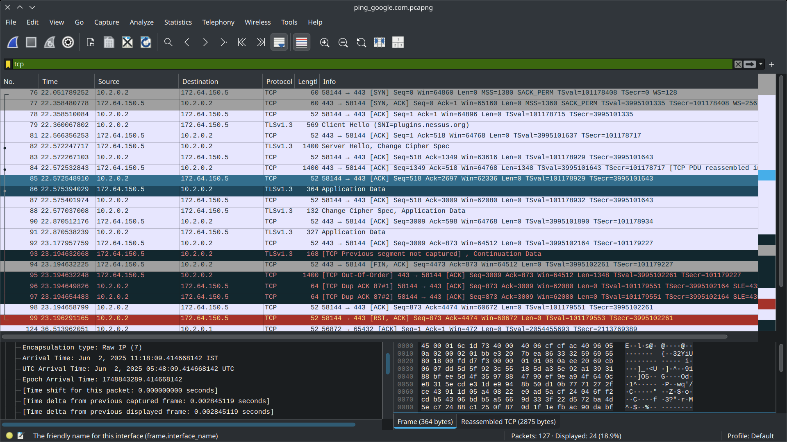

# ElateLabs-task5
Display working of wireshark

This displays the working of wireshark by tracking and analysing network packet transmission and use filter

1. Initialization

Choose the network interface the device is connected to

2. Tracking transmission

After choosing the interface the wireshark will look for any signal recieve or send. Capture the desired transmission.

In this case ping to google.com has been performed as a desired packet transmission lemma.

3. Analyse the transaction 

Use any display filter to lock into the transmission

The filter below shows transaction under DNS protocol

The filter seperates transaction under tcp protocol

The filter below shows transaction under ICMP protocol : the main transaction of packets during ping

4. Packet Analysis

By clicking a entity in the capture sheet the details of packet can also be analysed for details

The capture has also been linked for checking the details
Data/Report/ping_google.com.pcapng